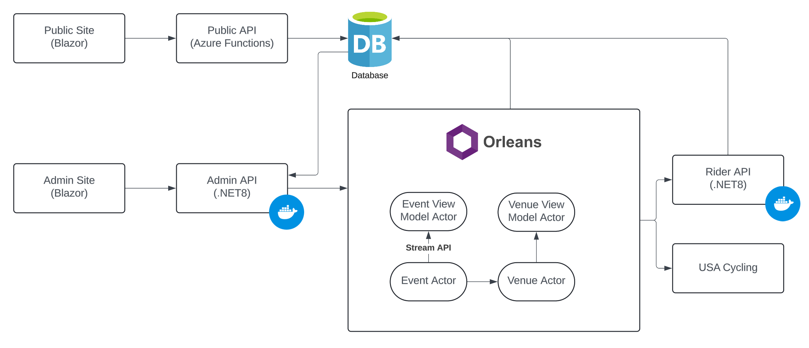

# NJ TT Cup

This repository hosts the code for the upcoming refresh of the NJ Time Trial Cup Series website. It currently hosts no production code.

The goal of this code is to provide a Proof Of Concept for implementing Event Sourcing with Microsoft Orleans in a real production environment. 

While the publicly available application (to be created) will be available at https://njttcup.com at some point, there is no intention to deploy the administrative site.

This application is also meant as a test bed and implementation hub for [tazor](https://github.com/jsedlak/tazor), which provides a tailwind component library, and [petl](https://github.com/jsedlak/petl) which provides the event sourcing implementation.

## Features & Goals

For our public site, the goal is to add a host of functionality for users.

1. Support Personal Best and Course Record tracking across seasons
2. Venues may have multiple courses, or courses may need to detour or change as the result of construction, permitting, or other reasons. I want to add support for tracking these course changes (and as a result, PBs and CRs per course)
3. Allow riders to submit changes that can be approved and automatically applied [as a command within the Orleans system]
4. Add rider searching, course searching, and better interfaces for results and championship leaderboards.
5. Provide a surface for analytics regarding participation and competition

## Architecture

The publicly available websites and APIs will be kept simple and straight forward to keep runtime costs low. The NJ TT Cup is a volunteer based program and collects no fees to keep the website running.

The administrative site and computation cluster use a number of technologies, generally as a way of gaining a better understanding of how they might react in a more complex scenario.

* Microsoft Orleans hosts a number of Grains that represent particular domains. The Championships domain consisting of Event and Leaderboard Actors, and the Locations domain consisting of the Venue Actor.
* Commands are processed within each Actor, and Events are both saved to the state and propagated via Orleans Streaming.
* Subscribing grains are responsible for updating/maintaining views, used by the admin and public sites.
* Service Grains provide long running operations to retrieve or calculate data, such as the USAC results loader, which currently needs to web scrape results.
* A separate domain for maintaining Riders provides an API endpoint to any grain, allowing for creation and retrieval of rider information. This is architected as a separate service to act as a sort of "microservice".



## Running

As-is, the solution is meant to run in docker with compose and hosts a local mongodb solution. Simply add your desired mongodb username/password to the environment files and execute the compose file.

```
docker compose up --build -d
```

Currently, the Admin Site is run separately, though there will be a docker option once it is more stable. Simply run the following command from within the project directory.

```
dotnet watch run .
```